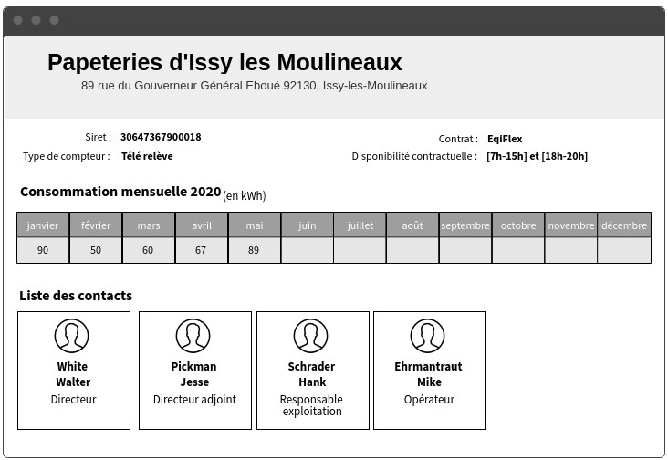
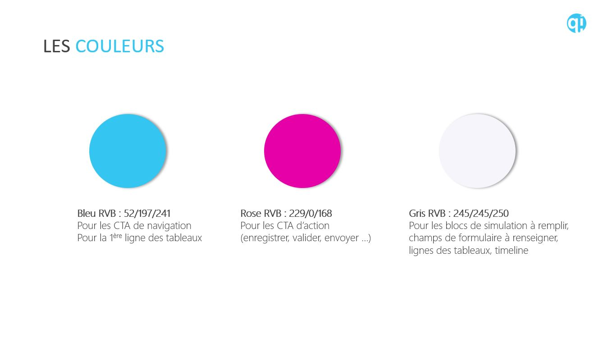

# Test de recrutement pour les développeurs Front-End

Bienvenue dans le projet de test de recrutement pour la société Eqinov. L'objectif est de tester vos compétences en développement d'interfaces web dans avec les outils que nous utilisons au quotidien.

## Pré-requis
### Installation de Java
Pour les besoins du test, nous utilisons un framework java permettant de lancer une api mockée : java doit donc être installé sur votre machine. 
Pour vérifier, lancer la commande DOS suivante :
----
java -version
----
Le système doit vous indiquer la version de java installée sur votre poste. Si ce n'est pas le cas, rendez-vous à la page suivante pour l'installer : https://www.java.com/fr/download/

### Utilisation de l'api mockée
l'api mockée retourne les données au format json qui vous seront utiles pour réaliser le premier exercice. 
Tout est disponible dans le dossier mock, où est présent le jar de wiremock (le framework que nous utilisons pour mockée une api).
Pour lancer l'api, lancer la commande DOS suivante :
----
java -jar wiremock-standalone-2.24.1.jar 
----
la console DOS doit afficher l'écran suivant indiquant que tout fonctionne correctement :
----
SLF4J: Failed to load class "org.slf4j.impl.StaticLoggerBinder".
SLF4J: Defaulting to no-operation (NOP) logger implementation
SLF4J: See http://www.slf4j.org/codes.html#StaticLoggerBinder for further details.
 /$$      /$$ /$$                     /$$      /$$                     /$$
| $$  /$ | $$|__/                    | $$$    /$$$                    | $$
| $$ /$$$| $$ /$$  /$$$$$$   /$$$$$$ | $$$$  /$$$$  /$$$$$$   /$$$$$$$| $$   /$$
| $$/$$ $$ $$| $$ /$$__  $$ /$$__  $$| $$ $$/$$ $$ /$$__  $$ /$$_____/| $$  /$$/
| $$$$_  $$$$| $$| $$  \__/| $$$$$$$$| $$  $$$| $$| $$  \ $$| $$      | $$$$$$/
| $$$/ \  $$$| $$| $$      | $$_____/| $$\  $ | $$| $$  | $$| $$      | $$_  $$
| $$/   \  $$| $$| $$      |  $$$$$$$| $$ \/  | $$|  $$$$$$/|  $$$$$$$| $$ \  $$
|__/     \__/|__/|__/       \_______/|__/     |__/ \______/  \_______/|__/  \__/

port:                         8080
enable-browser-proxying:      false
disable-banner:               false
no-request-journal:           false
verbose:                      false
----
l'api est disponible à l'adresse suivante : http://localhost:8080/eqinov/front/test que vous pouvez consulter avec une navigateur web pour vérifier le bon fonctionnement et les données.

## Travail demandé
### Contexte
Eqinov souhaite mettre à disposition de ses clients un nouvel écran pour son application dreams qui gère la flexibilité des consommation électriques de ses clients. Les objectifs de ce nouvel écran est :
* d'afficher les données de manière conviviale
* d'avoir une interface responsive (visualisable sur PC, tablette et smartphone)

### Stack technique 
Nous souhaitons réaliser cet nouvel écran avec les technologies suivantes :
* HTML 5
* CSS 3
* javascript

Vous pouvez utiliser des outils complémentaires comme jQuery,Bootstrap si vous le souhaitez ou tout autre framework dans le respect des technologies mentionnées précédemment.

### Exercice 1 : réalisation d'interface web
Nous avons mis à votre disposition, via une api, l'ensemble des données nécessaire à la réalisation de cette interface web, celle ci est disponible à l'adresse suivante : http://localhost:8080/eqinov/front/test.

En consultation avec notre service marketing, nous souhaitons afficher les données de la façon suivante :

Vous devrez respecter les règles graphiques suivantes mis en place dans notre application :

### Exercice 2 : modification de mockup
Nous avons la possibilité de récupérer l'historique des consommations réalisée et l'historique des consommations prévisionnelle de ce client sur une api d'un de nos partenaires. Cet historique est disponible pour plusieurs années et serait très utile à l'équipe opérationnelle afin d'étudier l'évolution de sa consommation. 

L'équipe opérationnelle souhaite enrichir l'ihm existante avec les éléments suivants :

- Avoir une courbe affichant la consommation réalisée et la consommation prévisionnelle
- Télécharger les données de consommation et de prévision à pas 10 min, 1/2h et 1h
- Mentionner la consommation totale sur l’année
- Pouvoir effectuer une sélection de date de visualisation de la courbe : jour, mois, trimestre, année. 

Question n°1 : faire une maquette d’interface logicielle présentant le maximum d’éléments qui vous paraissent pertinents en lien avec la demande de l’équipe métier.

Question n°2 : préciser les règles à appliquer sur l'ihm. 

